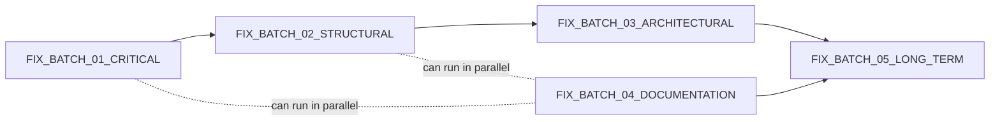

# FORGEWORLD — Constitutional Remediation Plan

Mission 3 deliverable. Builds directly on `intelligence/REPOSITORY_INTELLIGENCE_MODEL.md`
(Mission 2). Every issue below traces to a specific file/line already verified in that
document — nothing here is speculative. **No repository files outside `intelligence/`
were modified to produce this plan.**

"Constitutional compliance impact" is scored against the repo's own normative texts —
primarily `governance/CONSTITUTION_v3.txt` (Governance Principles, Resource Conservation
Mandate, Success Metric) and `governance/CONSTITUTION_v1.txt` (Forbidden list) — since
the repo already defines the standard it should be held to.

---

## 1. Method

For every issue: **Root cause → Systemic cause → Affected subsystems → Risk level →
Minimal fix → Unintended consequences → Validation strategy → Rollback strategy →
Regression tests → Constitutional compliance impact.**

Issues are numbered ISSUE-01…ISSUE-25. IDs F-1…F-5 from Mission 2 map directly onto
ISSUE-01, ISSUE-02, ISSUE-03, ISSUE-09, ISSUE-10 respectively (kept traceable, not
renumbered away).

Risk levels: **Critical** (active silent data loss or broken user-facing feature),
**High** (integrity/trust violation, no data loss yet), **Medium** (structural debt,
contained blast radius), **Low** (cosmetic/documentation).

---

## 2. Issue Register

### ISSUE-01 — `scripts/forge-world` crashes instead of rendering state (F-1)
- **Root cause:** `python "$WORLD" <<'PY' … PY` passes the JSON file as the script
  argument to `python`, which then tries to execute `world_state.json` as Python source
  (`SyntaxError`) instead of reading the heredoc from stdin with `$WORLD` as `sys.argv[1]`.
- **Systemic cause:** no script in the repo has ever been executed in an automated
  check; correctness was never verified beyond "looks right," because §9.13 diagnostics
  only tail logs, they never invoke `forge-world`.
- **Affected subsystems:** 9.10 World State Store.
- **Risk level:** Critical (user-facing command is 100% broken).
- **Proposed minimal fix:** `python - "$WORLD" <<'PY'` (dash tells Python to read the
  script from stdin, `"$WORLD"` becomes `sys.argv[1]`), no other line changes.
- **Potential unintended consequences:** none expected — single-line change, isolated
  script, no other file reads `forge-world`'s output.
- **Validation strategy:** run `scripts/forge-world` against the current
  `world/world_state.json` and confirm it prints world name/level/phase/resources/
  reputation instead of a traceback.
- **Rollback strategy:** single-line git revert.
- **Required regression tests:** a smoke test that runs `forge-world` and asserts exit
  code 0 and non-empty stdout containing `"World:"`.
- **Constitutional compliance impact:** violates "Every retained artifact must reduce
  uncertainty during future reconstruction" (Resource Conservation Mandate) — a broken
  reconstruction tool adds uncertainty rather than reducing it.

### ISSUE-02 — `scripts/forge-signal` silently discards captured signals (F-2)
- **Root cause:** the trailing `>> ~/forgeworld/events/signals.log` line has no command
  piped into it — it opens/touches the file and writes nothing; the five `echo` lines
  above it only ever reach stdout.
- **Systemic cause:** same as ISSUE-01 — no execution-time verification exists for any
  script; a plausible-looking heredoc/redirect pattern was never actually run and
  checked against the resulting file.
- **Affected subsystems:** 9.1 Capture & Command Dispatch, 9.11 Future Opportunity
  Generator (signals are the doctrine's stated feedstock for future opportunities).
- **Risk level:** Critical (silent, ongoing data loss — every signal captured to date
  is gone).
- **Proposed minimal fix:** wrap the five `echo` lines in a brace group or pipe them
  into the append target, e.g. `{ echo; echo "$(date)"; echo "SOURCE: $SOURCE"; ...; } >> ~/forgeworld/events/signals.log`.
- **Potential unintended consequences:** if `events/signals.log` did not previously
  exist, this will create it — confirm no other script assumes its absence.
- **Validation strategy:** run `forge-signal` once with test values, `cat
  events/signals.log`, confirm the five lines are present and match stdout.
- **Rollback strategy:** single-file git revert.
- **Required regression tests:** smoke test that feeds fixed stdin to `forge-signal`
  and asserts `signals.log` grew by the expected line count.
- **Constitutional compliance impact:** direct violation of "No memory without
  evidence" and "Every retained artifact must reduce uncertainty during future
  reconstruction" — evidence is captured then destroyed before it can become memory.

### ISSUE-03 — Duplicate, incompatible `world_state.json` schemas (F-3)
- **Root cause:** root `world_state.json` (v1-shaped: `world_name`, `resources`,
  `reputation`, `active_npcs`…) and `world/world_state.json` (v2-shaped: `continents`,
  `active_phase`, `primary_goal`) were created by different installer runs
  (`install_runtime_layers.sh` vs. a later, undocumented v2 pass) and never reconciled.
- **Systemic cause:** installers `cat >` files unconditionally with no check for an
  existing, differently-shaped file at a different path — versioning happened by adding
  a new file next to the old one instead of migrating it.
- **Affected subsystems:** 9.10 World State Store, 9.16 RPG Player/Quest Model
  (same dead-state pattern).
- **Risk level:** High (no data loss yet, but any future code that "reads world state"
  has a 50/50 chance of reading the wrong, stale, or wrong-shaped file).
- **Proposed minimal fix:** designate `world/world_state.json` as canonical (it lives
  inside the `world/` subsystem directory the Constitution names), delete or archive the
  root copy under `archive/`, and update `scripts/forge-world`'s `WORLD=` path if it
  ever pointed at the root file.
- **Potential unintended consequences:** any undiscovered script/human workflow
  referencing the root path breaks; mitigate by `grep -r world_state.json` across the
  repo before deleting (already confirmed only `scripts/forge-world` references a
  `world_state.json` path, and it points at `~/forgeworld/world_state.json` — this
  actually needs to be repointed to `world/world_state.json` as part of the fix, not
  left alone).
- **Validation strategy:** after the fix, `find . -name world_state.json` returns
  exactly one path; `forge-world` reads it successfully (depends on ISSUE-01 fix).
- **Rollback strategy:** git revert restores both files; low risk since this is a
  delete+repoint, not a data transformation.
- **Required regression tests:** repo-wide grep-based lint (see ISSUE-20) asserting
  exactly one `world_state.json` exists.
- **Constitutional compliance impact:** violates Resource Conservation Mandate's "No
  duplicate records" directly, and undermines the Success Metric ("Can the present
  state explain how it became itself?") — with two disagreeing state files, the answer
  is currently unanswerable.

### ISSUE-04 — Dead state pattern: `world_state.json` and `rpg/player.json` are never written by the pipeline
- **Root cause:** `log_event.sh` and `resolve_event.sh` only `>>` append prose to
  `.log` files; neither script (nor anything else) contains a `json.dump`/`jq`/sed call
  that mutates `world_state.json` or `rpg/player.json`. Both files hold their
  install-time default values (`all zero`) despite the `.log` files claiming state
  changes occurred.
- **Systemic cause:** the Constitution specifies world state as the "accumulated
  result of validated consequences" but no installer ever built the consequence→state
  writer — the doctrine describes the last mile of the pipeline that was never coded.
- **Affected subsystems:** 9.9 Consequence Engine, 9.10 World State Store, 9.16 RPG
  Player/Quest Model.
- **Risk level:** High (the pipeline's own audit trail contradicts its "canonical"
  state file — a direct, currently-live violation of the Success Metric).
- **Proposed minimal fix:** this is architectural, not a one-liner — see
  FIX_BATCH_03. Minimal viable version: add a `apply_world_state_patch()` step to
  `resolve_event.sh` that increments one counter (e.g. `resources.evidence += 1`) in
  `world/world_state.json` via `python -c` or `jq`, proving the write path works before
  building the full patch semantics.
- **Potential unintended consequences:** concurrent writes if `resolve_event.sh` is
  ever invoked twice in parallel (no locking exists anywhere in the repo) could corrupt
  the JSON; single-user/manual-invocation usage today makes this low-probability but it
  should be documented as a known limitation, not silently assumed safe.
- **Validation strategy:** run `resolve_event.sh "test event"` before/after, diff
  `world_state.json`, confirm a field actually changed.
- **Rollback strategy:** restore `world_state.json` from git; the append-only `.log`
  files are unaffected either way, so rollback has zero risk to existing evidence.
- **Required regression tests:** event → state-diff assertion test (depends on
  ISSUE-03's single-canonical-file fix landing first).
- **Constitutional compliance impact:** this is the single highest-impact
  constitutional violation found: "Consequence precedes world-state change" and
  "World-state change precedes future opportunity" are both unsatisfiable while
  world-state never actually changes; the Success Metric itself currently reads "No."

### ISSUE-05 — Memory `SEED` and confirmed `MEMORY` lines have no shared linking ID
- **Root cause:** `log_event.sh` writes `MEMORY_SEED: <event> created possible
  memory.` and `resolve_event.sh` writes `MEMORY: The world remembers that <event>.`
  independently, with no event ID, timestamp correlation key, or cross-reference —
  matching is currently only possible by eyeballing near-identical sentence text.
- **Systemic cause:** two separate entry points (`log_event.sh`, `resolve_event.sh`)
  were built in different install phases (`install_runtime_layers.sh` then
  `install_phase5_runtime.sh`) targeting the same log file, without a shared event-ID
  scheme being designed first.
- **Affected subsystems:** 9.2 Event Logger, 9.3 Memory Writer.
- **Risk level:** Medium (no data loss; reconstruction gets combinatorially harder as
  volume grows, but today's volume is one event).
- **Proposed minimal fix:** introduce a monotonic or content-hash event ID
  (`EVT-<epoch>-<8-char-hash>`) generated once per invocation and threaded through every
  line either script writes for that event.
- **Potential unintended consequences:** changes the on-disk log line format, which
  breaks the `tail -N` assumptions in `diagnostics/*.sh` only cosmetically (they just
  print more text) — no script currently parses these lines programmatically, so this is
  safe to change without a parser migration.
- **Validation strategy:** run one event through both `log_event.sh` and
  `resolve_event.sh`, confirm the same ID appears in `events.log`, `memory.log`,
  `consequences.log`, `world_state.log`.
- **Rollback strategy:** git revert; log files are append-only so no historical data is
  destroyed by rolling back the format going forward.
- **Required regression tests:** assert ID presence and uniqueness across a run of N
  synthetic events.
- **Constitutional compliance impact:** violates "Every retained artifact must reduce
  uncertainty during future reconstruction" — without a join key, reconstruction is
  guesswork, not evidence-based.

### ISSUE-06 — `commands/FORGE_COMMANDS.md` documents a command language that doesn't exist
- **Root cause:** the doc specifies dot-notation verbs (`FORGE.STATUS`,
  `FORGE.CAPTURE`, `FORGE.SYNC`, `FORGE.REQUEST_BUILD`, `FORGE.REQUEST_REVIEW`,
  `FORGE.ARCHIVE`, `FORGE.EXPORT`); the actual dispatcher (`scripts/forge`) implements
  space-separated subcommands (`forge status`, `forge capture`, `forge event`, `forge
  npc`, `forge quest`, `forge review`, `forge sync`, `forge archive`, `forge map`,
  `forge doctrine`, `forge clean`) — different verbs, different syntax, only partial
  overlap.
- **Systemic cause:** the command doc was authored as a design spec before
  `scripts/forge` was implemented, and the implementation diverged without the doc
  being updated — a doc/code sync step doesn't exist in this repo's workflow.
- **Affected subsystems:** 9.1 Capture & Command Dispatch, 9.17 Command Docs.
- **Risk level:** Medium (no data loss, but actively misleads any new operator —
  including a future agent session — into typing nonexistent commands).
- **Proposed minimal fix:** rewrite `commands/FORGE_COMMANDS.md` to document the
  actual `scripts/forge` subcommand list verbatim (source of truth = the code, since
  the code is what a user actually runs).
- **Potential unintended consequences:** none — pure documentation change.
- **Validation strategy:** diff every documented command against `scripts/forge`'s
  `case` statement; confirm 1:1 coverage.
- **Rollback strategy:** git revert, zero risk.
- **Required regression tests:** none needed (docs aren't executable); optional lint
  script that greps `case` branches in `scripts/forge` and cross-checks against
  `FORGE_COMMANDS.md` headings.
- **Constitutional compliance impact:** violates "Continuity preserves
  explainability" — a doc that can't explain the actual system breaks continuity for
  the next operator/agent.

### ISSUE-07 — `npc/` (spec) vs `npcs/` (real data) naming collision
- **Root cause:** `npc/npc_memory.txt` (singular, fictional-NPC design spec) and
  `npcs/network.md` (plural, real professional contacts) are two different directories
  one letter apart, created by different tools (`install_runtime_layers.sh` creates
  `npc/`; `scripts/forge npc` subcommand creates `npcs/`) with no cross-reference.
- **Systemic cause:** the installer's directory-naming convention (singular for
  system-role directories) and the interactive dispatcher's naming convention (plural,
  chosen independently) were never reconciled — two authors' conventions collided.
- **Affected subsystems:** 9.4 NPC Memory / Network Ledger.
- **Risk level:** Medium (structural confusion, not data loss; but is upstream of the
  privacy issue in ISSUE-08 because it's unclear which directory is meant to hold real
  vs. fictional data).
- **Proposed minimal fix:** do not merge automatically — this requires the product
  decision in ISSUE-25 first (is `npcs/network.md` real-world CRM data or misplaced
  test data for a fictional-NPC feature?). Once decided: either rename `npcs/` →
  something explicitly real-world (e.g. `contacts/`) and keep `npc/` for fictional
  spec+data, or migrate `npc/npc_memory.txt`'s spec into `npcs/` and delete the
  singular directory.
- **Potential unintended consequences:** a rename changes paths referenced by
  `scripts/forge npc` (`$ROOT/npcs/network.md`) — must update the script atomically
  with the directory move, in the same commit, to avoid a broken write path.
- **Validation strategy:** after rename, run `forge npc` once and confirm it writes to
  the new path with no error.
- **Rollback strategy:** `git mv` is trivially reversible; rollback is a second `git
  mv` back.
- **Required regression tests:** smoke test asserting `forge npc` writes to the
  documented, current path.
- **Constitutional compliance impact:** violates Resource Conservation Mandate's "No
  duplicate records" / "No redundant processes" in spirit (two directories for
  overlapping semantic territory) and blurs "System Roles" as defined in Constitution
  v3 (`npc/ preserves perspective` — but the populated directory is `npcs/`, not `npc/`).

### ISSUE-08 — Real personal data in `npcs/network.md` with no governance/consent policy
- **Root cause:** `npcs/network.md` contains three real named individuals
  (Thomas Wandrack, Yuliya Karnaukh, Tim Avants) with inferred-intent classifications
  (one tagged `"Opportunity Signal: Decision control / employment"`), committed to a
  version-controlled repository. `doctrine/linkedin_protocol.md`, the file whose name
  implies it should govern exactly this data, is empty (0 bytes).
- **Systemic cause:** the doctrine layer was written aspirationally (naming a
  governance file for third-party data) before the governance content itself was
  authored — the repo has a habit of creating the *placeholder* for a control before
  the control exists (see ISSUE-10 for the general pattern).
- **Affected subsystems:** 9.4/9.18 NPC Memory / Network Ledger, 9.12 Governance &
  Doctrine.
- **Risk level:** Critical for a live/public repo (real personal data with no consent
  or redaction posture); High even if the repo is confirmed private (still no defined
  retention/purpose limitation, no data subject rights process, no policy on what
  happens when a future automated step — e.g. ISSUE-22's Council of Minds or the
  Future Opportunity Generator — starts *acting* on these records rather than just
  storing them).
- **Proposed minimal fix:** (1) confirm and document repository visibility in
  `doctrine/linkedin_protocol.md`; (2) write a minimal data-handling policy there
  (what may be stored, purpose limitation, no automated outreach without explicit
  per-contact review, deletion-on-request process); (3) until that policy exists, treat
  `npcs/network.md` as frozen — no new real-person entries.
- **Potential unintended consequences:** if the repo must be made private or the file
  redacted, this touches git history (see Rollback strategy) — a bigger operation than
  a normal file edit, needs explicit user sign-off before executing, per the "Executing
  actions with care" norms this session already operates under.
- **Validation strategy:** policy document review (human judgment, not automatable);
  confirm no script writes to `npcs/network.md` without going through a path that
  checks the policy exists.
- **Rollback strategy:** if history rewrite is ever needed to remove committed PII,
  that is a destructive operation requiring explicit user approval and coordination
  (force-push implications, collaborator impact) — **not** something this remediation
  plan authorizes on its own.
- **Required regression tests:** none (policy, not code) — optionally, a pre-commit
  hook that flags new entries under `npcs/`/`contacts/` for manual review.
- **Constitutional compliance impact:** violates "No persistence without governance"
  and "Accountability accompanies persistence" directly — this is the clearest case in
  the repo of persistence existing without the governance the Constitution requires for
  it.

### ISSUE-09 — `continuity/` module declared but never scaffolded (F-4)
- **Root cause:** `governance/CONSTITUTION_v3.txt`'s Runtime Topology section lists
  `continuity/ connects time` as a System Role; no installer (`install_runtime_layers.sh`,
  `install_constitution_v3.sh`, `install_phase5_runtime.sh`) ever creates a
  `continuity/` directory or any file under that name.
- **Systemic cause:** Constitution v3 was authored as a superset vision document ahead
  of the installers that were supposed to implement it; the installer for v3
  (`install_constitution_v3.sh`) only writes the constitution text itself and a
  diagnostic script, not the directory structure the text describes.
- **Affected subsystems:** 9.12 Governance & Doctrine (spec-implementation gap).
- **Risk level:** Medium (nothing is broken — a promised capability simply doesn't
  exist yet — but it is a standing discrepancy between doctrine and reality that
  undermines trust in the rest of the doctrine).
- **Proposed minimal fix:** either (a) scaffold `continuity/` with a spec file
  analogous to its siblings (e.g. `continuity/continuity_ledger.txt` describing what
  cross-time linkage it's meant to provide — likely the event-ID linkage from ISSUE-05),
  or (b) if the role is intentionally subsumed by existing logs, remove the line from
  Constitution v3 rather than leave an unfulfilled promise. Recommend (a): use it as the
  actual home for the event-ID scheme from ISSUE-05.
- **Potential unintended consequences:** none if scaffolded as a spec-only directory
  first (no script depends on its absence).
- **Validation strategy:** re-run `diagnostics/constitution_v3_check.sh`-style presence
  check for `continuity/` alongside the other ten declared system-role directories.
- **Rollback strategy:** delete the directory; trivial, no dependents yet.
- **Required regression tests:** presence-check lint (see ISSUE-20) covering all
  eleven declared system-role directories, not just the ones that happen to exist today.
- **Constitutional compliance impact:** direct spec-vs-implementation gap against
  Constitution v3's own Runtime Topology section — the Constitution is currently
  describing a system that doesn't fully exist.

### ISSUE-10 — Five empty placeholder files (F-5)
- **Root cause:** `doctrine/governance.md`, `doctrine/identity.md`,
  `doctrine/linkedin_protocol.md`, `tasks/roadmap.md`, `tasks/milestones.md` all exist
  at 0 bytes — created (likely via `touch` or an editor save-without-content) but never
  authored.
- **Systemic cause:** same "name the placeholder before writing the control" pattern
  as ISSUE-08/ISSUE-09 — the repo's growth pattern favors scaffolding file names ahead
  of content, and nothing flags a file that's stayed empty since creation.
- **Affected subsystems:** 9.12 Governance & Doctrine, 9.16 RPG Player/Quest Model.
- **Risk level:** Low (no functional breakage — nothing reads these files
  programmatically today) but compounds ISSUE-08's severity specifically for
  `linkedin_protocol.md`.
- **Proposed minimal fix:** for each file, either author minimal real content or
  delete it; do not leave any file at 0 bytes after this remediation completes.
  `linkedin_protocol.md` should be prioritized (feeds ISSUE-08); `tasks/roadmap.md`
  and `tasks/milestones.md` can simply point at
  `intelligence/REPOSITORY_INTELLIGENCE_MODEL.md` §11 and this document's batch plan
  rather than duplicating content.
- **Potential unintended consequences:** none.
- **Validation strategy:** `find . -type f -empty` returns zero results (excluding
  intentionally-empty files like `.gitkeep`, if any are added later).
- **Rollback strategy:** trivial git revert.
- **Required regression tests:** empty-file lint as part of the CI check in ISSUE-20.
- **Constitutional compliance impact:** violates "No expansion without increased
  explanatory power" — an empty file is pure expansion (one more path to track) with
  zero explanatory power.

### ISSUE-11 — 80%-duplicated diagnostic scripts
- **Root cause:** `diagnostics/constitution_check.sh`, `constitution_v3_check.sh`, and
  `phase5_check.sh` each independently hardcode the same `tail -N` sequence over
  `events.log`/`memory.log`/`consequences.log`/`world_state.log`, differing only in
  which constitution file they test for and cosmetic labels.
- **Systemic cause:** each diagnostic script was generated by its own installer run
  (`install_constitution_v3.sh`, `install_phase5_runtime.sh`) as a self-contained
  heredoc, with no shared library — installers copy-paste rather than compose.
- **Affected subsystems:** 9.13 Diagnostics.
- **Risk level:** Medium (not broken today, but any future fix to the "recent events"
  logic has to be applied three times or it silently drifts — classic copy-paste-drift
  risk already latent).
- **Proposed minimal fix:** extract a shared `diagnostics/_lib.sh` with a
  `print_recent_state()` function; have all three scripts source it and pass only their
  differing header/labels as arguments. Keep all three entrypoints for backward
  compatibility with existing muscle-memory commands.
- **Potential unintended consequences:** if `_lib.sh` has a bug, it now affects three
  call sites instead of one — mitigate with the regression test below before rollout.
- **Validation strategy:** run all three scripts before and after, diff stdout —
  should be byte-for-byte identical except intentional label differences.
- **Rollback strategy:** git revert restores the three original standalone scripts.
- **Required regression tests:** golden-output test comparing each script's stdout
  against a recorded baseline.
- **Constitutional compliance impact:** violates Resource Conservation Mandate's "No
  redundant processes."

### ISSUE-12 — No faction registry; faction memory references undefined factions
- **Root cause:** `factions/faction_memory.log` writes generic lines
  ("Factions must evaluate benefit, loss, and alignment after: …") but no file anywhere
  in the repo names an actual faction — the spec (`factions/faction_memory.txt`)
  describes per-faction fields (goals, allies, enemies…) that have never been
  instantiated for any faction.
- **Systemic cause:** Phase 5 doctrine assumes factions exist as first-class entities
  feeding the pipeline, but no installer or command creates a faction registry (unlike
  NPCs, which at least have `scripts/forge npc`).
- **Affected subsystems:** 9.5 Faction Memory.
- **Risk level:** Low (no faction has ever been referenced incorrectly — because none
  has ever been referenced concretely at all).
- **Proposed minimal fix:** add a `forge faction` subcommand mirroring `forge npc`,
  writing to a new `factions/registry.md`; until then, downgrade
  `faction_memory.log`'s generic line to explicitly say "no faction registry entry
  matched" rather than implying evaluation happened.
- **Potential unintended consequences:** none — purely additive.
- **Validation strategy:** run `forge faction`, confirm `factions/registry.md` gains
  an entry.
- **Rollback strategy:** trivial revert.
- **Required regression tests:** smoke test for the new subcommand.
- **Constitutional compliance impact:** violates "Authority emerges from traceable
  evidence" — faction-level claims currently have no traceable subject.

### ISSUE-13 — Reputation system never computes a value, only flags "needs evaluation"
- **Root cause:** `resolve_event.sh` writes `"Reputation requires evaluation after:
  …"` — a to-do note, not a score — for every event; nothing in the repo ever resolves
  that to-do into one of the ten dimensions the spec (`reputation/reputation_system.txt`)
  defines (trust, fear, honor, suspicion…).
- **Systemic cause:** same doctrine-ahead-of-implementation pattern; the spec was
  written in full before any scoring logic was designed.
- **Affected subsystems:** 9.6 Reputation System.
- **Risk level:** Medium (the Constitution's causal chain explicitly requires
  "Reputation precedes consequence," but consequences are already being logged for
  events whose reputation was never actually evaluated — a chain-of-custody gap).
- **Proposed minimal fix:** minimal viable scorer: a fixed-vocabulary keyword scan
  (e.g. "defeated," "helped," "betrayed") that assigns a coarse +1/0/-1 to one
  dimension per event, logged as an actual value instead of a to-do sentence. Full
  scoring model is LONG_TERM (Batch 5), not this fix.
- **Potential unintended consequences:** a naive keyword scorer will misclassify
  nuanced events; document it explicitly as a placeholder heuristic, not a trustworthy
  score, to avoid the doctrine's own "Narrative without consequence" trap being replaced
  by "consequence without real evidence."
- **Validation strategy:** run several synthetic events with known expected sentiment,
  confirm the scorer's output direction matches.
- **Rollback strategy:** revert to the to-do-line behavior; no data model changes
  elsewhere depend on the score existing yet.
- **Required regression tests:** table-driven test of event text → expected score
  direction.
- **Constitutional compliance impact:** currently violates "Reputation precedes
  consequence" (consequence logging proceeds regardless of whether reputation was
  evaluated); the minimal fix makes this at least partially true rather than never true.

### ISSUE-14 — `relationships/` subsystem has no design spec
- **Root cause:** every sibling subsystem (events, memory, npc, factions, reputation,
  consequences, world) has a `.txt` design spec written by an installer;
  `relationships/relationships.log` was added directly in Phase 5 doctrine
  (`PHASE_5_RUNTIME.txt`) with no corresponding `relationships/relationships_model.txt`
  ever created.
- **Systemic cause:** Phase 5 was installed by `install_phase5_runtime.sh`, which
  creates the `relationships/` directory (`mkdir -p`) but its heredoc-writer list omits
  a spec file for it — an oversight in that specific installer, not a doctrine gap (the
  doctrine does define relationship semantics in `PHASE_5_RUNTIME.txt`'s "RELATIONSHIP
  asks: Who trusts whom?").
- **Affected subsystems:** 9.7 Relationship Tracker.
- **Risk level:** Low.
- **Proposed minimal fix:** add `relationships/relationships_model.txt` following the
  exact structural pattern of its siblings (Purpose / fields tracked / what it feeds).
- **Potential unintended consequences:** none — additive documentation only.
- **Validation strategy:** manual review for consistency with sibling specs.
- **Rollback strategy:** trivial revert.
- **Required regression tests:** none (spec-only).
- **Constitutional compliance impact:** minor — consistency gap against "System
  Roles" enumeration convention, not a direct clause violation.

### ISSUE-15 — Consequence Engine has no rollback mechanism despite spec requirement
- **Root cause:** `consequences/consequence_engine.txt` requires every consequence to
  define a "rollback possibility," but no script in the repo implements reversing a
  consequence — `resolve_event.sh` only appends, it never removes or supersedes a prior
  entry.
- **Systemic cause:** append-only logging was chosen as the simplest persistence
  mechanism early on and never revisited once the spec later added a rollback
  requirement (`consequence_engine.txt` postdates the append-only script design).
- **Affected subsystems:** 9.9 Consequence Engine.
- **Risk level:** Medium (governance doctrine explicitly asks "Can it be reversed?" as
  a required diagnostic question in `master_persistence_directive.txt`; today the
  answer is structurally "no" for every consequence ever logged).
- **Proposed minimal fix:** append-only logs can support rollback via a compensating
  entry pattern (write a `ROLLBACK: <original event id>` line rather than mutating
  history) — this preserves the append-only, auditable design while satisfying the
  spec. Requires the event-ID scheme from ISSUE-05 to reference which consequence is
  being rolled back.
- **Potential unintended consequences:** compensating entries require every downstream
  reader (diagnostics, future world-state writer from ISSUE-04) to treat a rollback
  entry as canceling its referent — must be designed once, consistently, not per-script.
- **Validation strategy:** log a consequence, roll it back, confirm the state writer
  (once ISSUE-04 exists) nets to no change.
- **Rollback strategy:** (meta) reverting this fix itself is a normal git revert;
  it doesn't touch existing log content.
- **Required regression tests:** log→rollback→net-zero-effect test.
- **Constitutional compliance impact:** currently violates "Deletion requires review"
  / "Can it be reversed?" governance question; depends on ISSUE-05 landing first.

### ISSUE-16 — Installers overwrite files non-idempotently with no diff/confirm step
- **Root cause:** `install_constitution_v3.sh`, `install_phase5_runtime.sh`,
  `install_runtime_layers.sh` all use `cat > "$FILE" <<'DOC' … DOC`, which
  unconditionally truncates and rewrites the target file even if it already exists
  with different (possibly manually edited) content.
- **Systemic cause:** installers were designed for first-time setup only; no one
  revisited them once the repo reached a state where re-running an installer against a
  live, hand-edited tree became a plausible operation.
- **Affected subsystems:** 9.14 Install/Bootstrap Layer, transitively every subsystem
  whose files an installer writes.
- **Risk level:** Medium (no incident has occurred yet — `logs/install.log` shows each
  installer ran exactly once — but the risk is latent and silent: a second run would
  destroy any manual edit with zero warning).
- **Proposed minimal fix:** before each `cat >`, check `[ -f "$FILE" ] &&
  ! diff -q <(cat <<'DOC' ... DOC) "$FILE" && { echo "SKIP: $FILE differs from
  installer template, leaving as-is (rerun with --force to override)"; }` pattern, or
  simpler: have installers refuse to overwrite and instead write `.new` files for human
  diff/merge when the target already exists and differs.
- **Potential unintended consequences:** changes installer behavior for anyone relying
  on "just re-run it to reset" — document the new `--force` escape hatch clearly.
- **Validation strategy:** hand-edit one governed file, re-run its installer, confirm
  the edit survives (or a `.new` file appears) instead of being silently clobbered.
- **Rollback strategy:** git revert restores unconditional-overwrite behavior; no data
  is at risk from reverting this fix itself.
- **Required regression tests:** edit-then-reinstall test asserting the edit is
  preserved (or explicitly flagged), not silently lost.
- **Constitutional compliance impact:** violates "Persistence requires review" /
  "Deletion requires review" (CONSTITUTION_v1) — an unconditional overwrite is an
  unreviewed deletion of whatever was there before.

### ISSUE-17 — `forge-sync-pack.sh` references nonexistent directories
- **Root cause:** the `tar -czf` command list includes `ideas` and `bugs` directories
  that do not exist anywhere in this repository; `tar`'s `2>/dev/null` swallows the
  resulting "No such file or directory" errors, so the script appears to succeed while
  silently omitting content it claims to package.
- **Systemic cause:** the script was likely written against an earlier or
  aspirational directory layout that was never realized or was since removed, and the
  stderr suppression masks the drift instead of surfacing it.
- **Affected subsystems:** 9.15 Ops Layer.
- **Risk level:** Low (sync packages are simply smaller than intended; no data
  corruption).
- **Proposed minimal fix:** remove `ideas bugs` from the tar argument list, or create
  those directories if they're meant to exist — resolve in favor of whichever the
  current capture workflow (`CAPTURE.md`, `inbox/`) actually uses.
- **Potential unintended consequences:** none.
- **Validation strategy:** run `forge-sync-pack.sh`, inspect the resulting tarball
  contents match exactly the intended file list with no silent omissions.
- **Rollback strategy:** trivial revert.
- **Required regression tests:** tarball-contents assertion test.
- **Constitutional compliance impact:** minor — "No expansion without increased
  explanatory power" in the sense that the stderr-suppression itself is dead weight
  that hides real drift; low severity.

### ISSUE-18 — Hardcoded `$HOME/forgeworld` + Termux-only shebangs break portability
- **Root cause:** every script hardcodes `BASE="$HOME/forgeworld"` and
  `#!/data/data/com.termux/files/usr/bin/bash`; outside a Termux phone environment
  (e.g. this repo checked out at `/home/user/forgeworld-runtime`, or any laptop/CI
  runner), scripts either fail the shebang entirely or write to a `$HOME/forgeworld`
  path that doesn't correspond to the actual checkout.
- **Systemic cause:** the two-node (phone/laptop) topology was designed
  phone-first, and the laptop-side equivalent of these scripts (§9.10 "LAPTOP NODE" in
  Mission 2's roadmap) was never built — so nothing in the repo has ever needed to run
  outside Termux, and the assumption was never stress-tested.
- **Affected subsystems:** every script-bearing subsystem (9.1–9.15).
- **Risk level:** Medium (doesn't corrupt data, but blocks this remediation plan's own
  regression tests from running anywhere except a real Termux phone unless addressed).
- **Proposed minimal fix:** change `BASE="$HOME/forgeworld"` to
  `BASE="${FORGEWORLD_HOME:-$HOME/forgeworld}"` (environment-variable override with the
  existing default preserved) across all scripts, and change shebangs to
  `#!/usr/bin/env bash` (portable, still resolves correctly under Termux). This is a
  mechanical, uniform find-and-replace, not a redesign.
- **Potential unintended consequences:** `env bash` behaves identically to Termux's
  bash for every construct these scripts use (no Termux-specific bash features are
  used) — low risk; still worth running the full regression suite after.
- **Validation strategy:** `FORGEWORLD_HOME=$(pwd) ./runtime.sh` (and equivalents)
  succeed from a non-Termux shell in this sandbox, matching prior Termux-only output
  format.
- **Rollback strategy:** git revert; the default value keeps existing Termux behavior
  unchanged, so even a partial rollback is safe.
- **Required regression tests:** run the full diagnostic suite under both a
  `FORGEWORLD_HOME` override and the bare Termux default, confirm identical behavior.
- **Constitutional compliance impact:** indirect — a system that cannot run where it's
  being evaluated undermines "Continuity preserves explainability" for any operator
  (including a future agent session) working outside Termux specifically.

### ISSUE-19 — No input validation on capture (evidenced by one malformed real entry)
- **Root cause:** `scripts/forge`'s `capture)` branch does `read -r TYPE` /
  `read -r DETAIL` with no format check; the one real entry in `inbox/capture.md` shows
  `TYPE: forge eventforge npcforge-signal` — a clear paste/typing error that was written
  to disk verbatim with no validation catching it.
- **Systemic cause:** the entire capture layer optimizes for zero-friction phone
  entry (by design, per `doctrine/FORGEWORLD_RUNTIME.md`'s "Capture Before Build" rule)
  and has never had a validation pass added on top of that speed-first design.
- **Affected subsystems:** 9.1 Capture & Command Dispatch.
- **Risk level:** Low (cosmetic data-quality issue; does not cascade because nothing
  downstream parses `TYPE` programmatically today).
- **Proposed minimal fix:** constrain `TYPE` to the documented enum (`idea / bug /
  task / linkedin / observation / opportunity`) with a re-prompt loop on mismatch;
  leave `DETAIL` free-text by design.
- **Potential unintended consequences:** stricter validation could reject legitimate
  entries typed with extra whitespace/case differences — normalize (trim, lowercase)
  before comparing rather than doing an exact match.
- **Validation strategy:** feed the known-bad historical input, confirm it's now
  rejected with a re-prompt instead of silently written.
- **Rollback strategy:** trivial revert.
- **Required regression tests:** table-driven valid/invalid TYPE input test.
- **Constitutional compliance impact:** minor — feeds "Evidence precedes memory"
  indirectly; malformed evidence entering the chain degrades everything built on it
  later, even though nothing consumes `TYPE` programmatically yet.

### ISSUE-20 — No automated test/CI/assertion layer anywhere
- **Root cause:** `diagnostics/*.sh` only `tail` logs and print to stdout; none of
  them use `test`/`[[ ]]` assertions with a non-zero exit on failure, and there is no
  `.github/workflows/` or any other CI configuration in the repository.
- **Systemic cause:** this is the aggregate effect of every other issue in this
  register — each individual bug (ISSUE-01, ISSUE-02, especially) survived undetected
  specifically *because* nothing ever asserted expected behavior; this is the
  structural root that let the others persist.
- **Affected subsystems:** all (9.1–9.18) — this is a cross-cutting capability gap,
  not a single subsystem's fault.
- **Risk level:** High (as a systemic issue: it is the reason Critical bugs ISSUE-01
  and ISSUE-02 shipped and went unnoticed for the life of the repo).
- **Proposed minimal fix — phased:**
  1. *Phase A (pairs with Batch 2):* a smoke-test script
     (`diagnostics/regression_check.sh`) that runs one synthetic event through
     `resolve_event.sh`, then asserts (via `grep -q`, non-zero exit on failure) that
     every expected log file received the expected line. No state-mutation dependency.
  2. *Phase B (pairs with Batch 3, depends on ISSUE-04):* extend the same script to
     assert on structured JSON state deltas once `world_state.json` is actually
     written to.
- **Potential unintended consequences:** none — purely additive tooling; does not
  touch production log files (should run against a temp `FORGEWORLD_HOME` to avoid
  polluting real history, which also validates ISSUE-18's fix).
- **Validation strategy:** the test script's own execution *is* the validation
  strategy for every other issue in this register — this issue is a prerequisite for
  fully validating ISSUE-01 through ISSUE-19, not just itself.
- **Rollback strategy:** trivial — deleting the test script affects nothing else.
- **Required regression tests:** (self-referential) this issue's fix *is* the
  regression-test infrastructure other issues' "Required regression tests" fields
  depend on.
- **Constitutional compliance impact:** violates "Every retained artifact must reduce
  uncertainty during future reconstruction" at the meta level — without tests, no
  future change's correctness can be reconstructed/verified, only asserted by prose.

### ISSUE-21 — No LICENSE or `.gitignore`
- **Root cause:** repository root contains no `LICENSE` file and no `.gitignore`;
  `sync/*.tar.gz` (produced by `forge-sync-pack.sh`) and any future local `archive/`
  output currently have no ignore rule and risk being accidentally committed.
- **Systemic cause:** the repo was bootstrapped purely from Termux `install_*.sh`
  runs, which have no concept of repository-hygiene files — nothing in the installer
  chain was ever responsible for adding them.
- **Affected subsystems:** 9.12 Governance & Doctrine (repo-level hygiene), 9.15 Ops
  Layer (tarball output risk).
- **Risk level:** Low standalone, but compounds ISSUE-08 — no LICENSE leaves the
  legal terms of the repository undefined, and no `.gitignore` means generated
  artifacts (including anything `forge-sync-pack.sh` produces) could get committed
  alongside real personal data with no guardrail.
- **Proposed minimal fix:** add a `.gitignore` covering `sync/*.tar.gz`,
  `archive/`, and common OS/editor cruft; add a LICENSE once the user decides the
  intended terms (this is a user decision, not something to default silently).
- **Potential unintended consequences:** none for `.gitignore`; LICENSE choice has
  real legal effect and must not be picked unilaterally.
- **Validation strategy:** confirm `git status` after running `forge-sync-pack.sh`
  shows the generated tarball as ignored, not untracked-and-stageable.
- **Rollback strategy:** trivial revert.
- **Required regression tests:** none (config file, not logic).
- **Constitutional compliance impact:** ties to "No persistence without governance" —
  repository-level legal/hygiene governance is currently entirely undefined.

---

### Batch 5 candidates — capability gaps, not bugs

These four items don't have a "root cause" in the defect sense; they're scoped here
because Mission 2 identified them as structural gaps and this plan needs to place them
somewhere in the sequencing, not drop them.

### ISSUE-22 — Council of Minds logs nine questions per event, never answers any of them
- **Root cause / gap:** `resolve_event.sh` hardcodes nine `echo "<Role>:
  <question> $EVENT?"` lines; no LLM call, human-answer capture, or any resolution step
  exists downstream.
- **Systemic cause:** the nine-perspective structure is fully specified in doctrine
  (`EVOLUTION_DIRECTIVE_v1.txt`, `master_persistence_directive.txt`) but was authored
  as narrative flavor before any AI integration existed in the toolchain the repo uses.
- **Affected subsystems:** 9.8 Council of Minds.
- **Risk level:** N/A (gap, not defect) — flagged High priority for Batch 5 given
  Mission 2's ranking (§10: highest optimization potential in the repository).
- **Proposed minimal fix:** out of scope for a "minimal fix" — this is a genuine build
  item requiring a design decision (one multi-role prompt vs. nine independent calls)
  before implementation; scoped to Batch 5.
- **Potential unintended consequences:** introduces an external API dependency
  (cost, latency, availability) into a system whose Resource Conservation Mandate
  explicitly says "Act only when manually invoked" — must be designed to fail
  gracefully (fall back to the current question-only log) if the call fails, not block
  the rest of the pipeline.
- **Validation strategy / rollback / regression tests / constitutional impact:**
  deferred to the Batch 5 design spike itself — premature to define before the
  approach is chosen (see Mission 2 §11 RESEARCH item 1).

### ISSUE-23 — Laptop-side synthesis/simulation/visualization node has zero code
- **Root cause / gap:** every doctrine file names a "LAPTOP NODE" responsible for
  Build/Test/Simulate/Export; no file in the repository implements any of that role.
- **Systemic cause:** development to date has been entirely phone-first (Termux
  scripts); the two-node topology is half-built by construction.
- **Affected subsystems:** cross-cutting (would consume output from nearly every
  other subsystem).
- **Risk level:** N/A (gap) — Batch 5, LONG_TERM.
- **Constitutional compliance impact:** the Runtime Topology section names this node
  explicitly; its absence is a standing spec/implementation gap, same category as
  ISSUE-09 but far larger in scope.

### ISSUE-24 — LinkedIn signal→content→publish loop is undefined
- **Root cause / gap:** `doctrine/linkedin_protocol.md` (0 bytes) is the file that
  should define this; the "Core Loop" in `doctrine/FORGEWORLD_RUNTIME.md`
  (`LinkedIn -> Capture -> Memory -> Analysis -> Architecture -> Build -> Evidence ->
  Publish -> LinkedIn`) has no corresponding code anywhere.
- **Affected subsystems:** 9.11 Future Opportunity Generator, 9.18 Network/Signal
  Ledger, 9.12 Governance & Doctrine.
- **Risk level:** N/A (gap) — Batch 5; explicitly **blocked on ISSUE-08's policy work
  landing first**, since this loop would be the first thing to actually *act* on the
  real personal data in `npcs/network.md`.
- **Constitutional compliance impact:** cannot be built in a way that satisfies "No
  persistence without governance" until ISSUE-08 resolves.

### ISSUE-25 — Product identity ambiguity (RPG vs. CRM vs. agent-memory framework)
- **Root cause / gap:** three plausible product identities coexist in the doctrine
  and pull the data model in different directions (see Mission 2 §11 RESEARCH item 2);
  no decision has been recorded anywhere.
- **Affected subsystems:** cross-cutting; directly blocks a clean resolution of
  ISSUE-07 (npc/npcs naming) and shapes how ISSUE-24 should be designed.
- **Risk level:** N/A (decision, not defect) — Batch 5, RESEARCH; recommended to be
  resolved **before** ISSUE-07's directory rename, since the rename target depends on
  the answer.
- **Constitutional compliance impact:** ties to Resource Conservation Mandate's "No
  expansion without increased explanatory power" — building further on an undecided
  identity risks exactly this kind of low-explanatory-power expansion.

---

## 3. Implementation Batches

Sequencing logic: Batch 1 stops active harm (data loss, broken commands, live privacy
exposure) with zero-to-minimal blast radius. Batch 2 removes structural ambiguity
(duplicate files, naming collisions, missing links) so Batch 3's architectural work has
a single, unambiguous target to build against. Batch 3 is the only batch that changes
core pipeline *behavior* (state actually mutates), so it is sequenced last among the
"fix" batches and gated on 1+2 landing cleanly. Batch 4 (pure documentation) has no
code dependencies and can run fully in parallel with 1–3. Batch 5 is explicitly gated
on 1–4: building the Council-of-Minds integration or the LinkedIn loop on top of an
unreliable state layer and an unresolved privacy policy would just create new
instances of the same defect class this plan exists to close.

### FIX_BATCH_01_CRITICAL
**Contains:** ISSUE-01, ISSUE-02, ISSUE-08 (policy decision + freeze, not full remediation).

| Metric | Estimate | Rationale |
|---|---|---|
| Implementation complexity | **Low** | Two are single-line/single-block script fixes; ISSUE-08 is a policy-writing task, not code. |
| Expected architectural benefit | **Low–Medium** | Fixes isolated leaves of the dependency graph; doesn't change core architecture. |
| Commercial benefit | **Medium** | Removes the one live legal/reputational exposure (real PII with no policy) blocking any external-facing use of the repo. |
| Validation effort | **Low** | Each fix has a single, cheap, manual validation step; no test infra required yet. |

### FIX_BATCH_02_STRUCTURAL
**Contains:** ISSUE-03, ISSUE-05, ISSUE-06, ISSUE-07 (pending ISSUE-25 input),
ISSUE-11, ISSUE-14, ISSUE-17, ISSUE-18, ISSUE-19, ISSUE-20 Phase A.

| Metric | Estimate | Rationale |
|---|---|---|
| Implementation complexity | **Medium** | Mostly mechanical (renames, shared libraries, env-var defaults) but touches many files at once; ISSUE-07 has a soft dependency on the Batch 5 identity decision. |
| Expected architectural benefit | **High** | Removes every duplicate/ambiguous file and wires the first real regression-test harness — the precondition for everything in Batch 3 being verifiable. |
| Commercial benefit | **Low** | Internal quality improvement; not customer/user-visible on its own. |
| Validation effort | **Medium** | Introduces the regression-test script itself (ISSUE-20 Phase A), so this batch pays for its own validation infrastructure going forward. |

### FIX_BATCH_03_ARCHITECTURAL
**Contains:** ISSUE-04, ISSUE-09, ISSUE-12, ISSUE-13, ISSUE-15, ISSUE-16,
ISSUE-20 Phase B.

| Metric | Estimate | Rationale |
|---|---|---|
| Implementation complexity | **High** | This is the only batch that changes core pipeline behavior (state actually mutates, rollback semantics introduced, installer overwrite protection added) — real design work, not mechanical fixes. |
| Expected architectural benefit | **Very High** | Closes the single biggest gap found in Mission 2 (dead state pattern) and makes the Constitution's Success Metric answerable in the affirmative for the first time. |
| Commercial benefit | **Medium** | A pipeline that actually produces structured, queryable state is the precondition for any real product (RPG, CRM, or agent-memory framework) — high *enabling* value, but not itself customer-facing. |
| Validation effort | **High** | Requires the full regression suite (ISSUE-20 Phase B) plus manual review of state-mutation correctness; highest-risk batch for silent regressions if under-tested. |

### FIX_BATCH_04_DOCUMENTATION
**Contains:** ISSUE-10, ISSUE-21, plus doc-quality follow-through from ISSUE-06 (final proofread pass), ISSUE-14's spec authoring.

| Metric | Estimate | Rationale |
|---|---|---|
| Implementation complexity | **Low** | Pure content authoring, no code paths touched. |
| Expected architectural benefit | **Low** | Improves explainability/onboarding, doesn't change runtime behavior. |
| Commercial benefit | **Low–Medium** | LICENSE decision in particular has real (if indirect) commercial/legal significance — undefined terms block any external sharing or collaboration. |
| Validation effort | **Low** | Manual review only; can run fully parallel to every other batch. |

### FIX_BATCH_05_LONG_TERM
**Contains:** ISSUE-22, ISSUE-23, ISSUE-24, ISSUE-25.

| Metric | Estimate | Rationale |
|---|---|---|
| Implementation complexity | **Very High** | Each item is a genuine multi-week build (LLM integration, an entire second "node" of the topology, a consent-gated automation loop) or a decision with wide downstream reach (product identity). |
| Expected architectural benefit | **Very High** (ISSUE-22, ISSUE-25) / **High** (ISSUE-23, ISSUE-24) | ISSUE-22 in particular converts the repo's most distinctive, already-fully-specified idea (nine-perspective review) into real functionality; ISSUE-25 unblocks every subsequent data-model decision. |
| Commercial benefit | **High**, but **contingent** | ISSUE-25's answer determines whether ISSUE-23/24's build effort produces a sellable product or a hobby simulation — do not fund ISSUE-23/24 substantially before ISSUE-25 is answered. |
| Validation effort | **Very High** | New external dependencies (LLM calls), new consent/privacy surfaces, and cross-node integration testing that doesn't exist yet in any form. |

---

## 4. What This Plan Deliberately Does Not Do

Per the mission instruction, no file outside `intelligence/` was modified while
producing this document — every "proposed minimal fix" above is a proposal, not a
diff. ISSUE-08's real-personal-data question in particular should get explicit user
sign-off on the chosen remediation (freeze vs. redact vs. history-rewrite) before any
Batch 1 execution begins, consistent with this session's standing norm of confirming
before actions with real-world, hard-to-reverse consequences.
