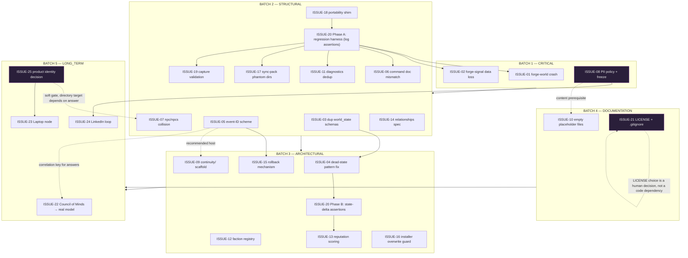

# FORGEWORLD — Implementation Dependency Graph

Mission 4 deliverable, part 2 of 4. Builds on the 25-issue register in
`intelligence/CONSTITUTIONAL_REMEDIATION_PLAN.md` and the laws in
`intelligence/ARCHITECTURAL_DOCTRINE.md` §3–4. No new issues are introduced here — this
document only maps how the existing ones relate. Per Architectural Doctrine §4
("no change may be classified ARCHITECTURAL or LONG_TERM if a CRITICAL or STRUCTURAL
prerequisite for it is still open"), every edge below is a hard gate, not a suggestion.

---

## 1. Full Dependency Graph

Purple nodes (`ISSUE-08`, `ISSUE-21`, `ISSUE-25`) require an explicit human decision,
not just engineering effort — they cannot be marked READY by code review alone (see
`IMPLEMENTATION_READINESS_MATRIX.md`).

---

## 2. Per-Issue Dependency Ledger

Every planned change, with prerequisites, affected systems, and the four closure
requirements the mission specified. "Affected subsystems" references
`REPOSITORY_INTELLIGENCE_MODEL.md` §9.x. "Knowledge update" names which permanent
document must change once the fix lands, per Architectural Doctrine §6.

| Issue | Prerequisites | Affected subsystems | Validation requirement | Rollback requirement | Documentation update | Knowledge update |
|---|---|---|---|---|---|---|
| ISSUE-01 | ISSUE-20 Phase A (to catch regressions) | 9.10 | `forge-world` exits 0, prints world fields | git revert (1 line) | none | Mark ISSUE-01 resolved in Remediation Plan; note in Doctrine §5.4 that this was the harness's first real catch |
| ISSUE-02 | ISSUE-20 Phase A | 9.1, 9.11 | `signals.log` grows by expected lines after one run | git revert | none | Mark ISSUE-02 resolved |
| ISSUE-03 | none (can run parallel to ISSUE-01/02) | 9.10, 9.16 | exactly one `world_state.json` path exists repo-wide | git revert (restores both files) | update `REPOSITORY_INTELLIGENCE_MODEL.md` §1 (Reality Baseline no longer references dual schema) | Confirms LAW 1 is enforceable once ISSUE-20 exists |
| ISSUE-04 | ISSUE-03 (single canonical file) | 9.9, 9.10, 9.16 | event → JSON diff assertion (ISSUE-20 Phase B) | restore `world_state.json` from git; logs unaffected | `REPOSITORY_INTELLIGENCE_MODEL.md` §1 Reality Baseline fact #1 becomes false — must be corrected, not deleted (state history) | This is the fact that makes the Constitution's Success Metric answerable — record the date it first became true |
| ISSUE-05 | none | 9.2, 9.3 | same ID present across `events.log`/`memory.log`/`consequences.log` for one synthetic event | git revert | none | Establishes `COMPOUND-01` (Compounding Report) as delivered |
| ISSUE-06 | ISSUE-20 Phase A (optional lint) | 9.1, 9.17 | 1:1 diff between doc and `scripts/forge` case branches | git revert | `REPOSITORY_INTELLIGENCE_MODEL.md` §9.17 failure-mode note updated | Establishes LAW 6 precedent |
| ISSUE-07 | **ISSUE-25** (soft — rename target depends on identity decision) | 9.4 | `forge npc` writes successfully to new path | `git mv` back | update path references in Remediation Plan ISSUE-07 entry | none until ISSUE-25 resolved |
| ISSUE-08 | none (human decision, not code) | 9.4, 9.12, 9.18 | policy document review (manual) | N/A — decision, not a diff | `doctrine/linkedin_protocol.md` authored | Establishes LAW 5 enforceability date |
| ISSUE-09 | none (ISSUE-05 recommended co-landing) | 9.12 | presence-check lint passes for all 11 declared system-role dirs | delete directory | `REPOSITORY_INTELLIGENCE_MODEL.md` §1 Reality Baseline updated | none |
| ISSUE-10 | ISSUE-08 (for `linkedin_protocol.md` content specifically) | 9.12, 9.16 | `find . -type f -empty` returns zero | git revert | Remediation Plan ISSUE-10 marked resolved | none |
| ISSUE-11 | ISSUE-20 Phase A | 9.13 | golden-output diff, 3 scripts pre/post identical modulo labels | git revert | none | Establishes `COMPOUND-04` delivered |
| ISSUE-12 | none | 9.5 | `forge faction` writes a registry entry | git revert | Remediation Plan ISSUE-12 marked resolved | none |
| ISSUE-13 | ISSUE-20 Phase B (to validate scoring direction) | 9.6 | table-driven event→score-direction test passes | git revert (no downstream dependents yet) | Remediation Plan ISSUE-13 marked resolved, flagged as heuristic not final model | Feeds future ISSUE-22 design (Council of Minds may consume reputation scores) |
| ISSUE-14 | none | 9.7 | manual spec-consistency review | git revert | none | none |
| ISSUE-15 | ISSUE-05 (event-ID for rollback target reference) | 9.9 | log→rollback→net-zero-effect test | git revert of the fix itself (compensating entries in history are not reverted) | `ARCHITECTURAL_DOCTRINE.md` §8 pattern confirmed in production | Establishes `COMPOUND-06` delivered |
| ISSUE-16 | none | 9.14 | edit-then-reinstall test: edit survives or is flagged | git revert | none | Confirms LAW 4 enforceable |
| ISSUE-17 | ISSUE-20 Phase A | 9.15 | tarball contents match intended list exactly | git revert | none | none |
| ISSUE-18 | none (this is itself a foundational prerequisite for ISSUE-20) | all script-bearing subsystems | full diagnostic suite runs identically under `FORGEWORLD_HOME` override vs. Termux default | git revert (default value preserves old behavior) | `ARCHITECTURAL_DOCTRINE.md` §5.4 evidence note updated with the fix date | Establishes `COMPOUND-09` delivered; unblocks all of Batch 2/3 validation |
| ISSUE-19 | ISSUE-20 Phase A | 9.1 | known-bad historical input now rejected | git revert | none | none |
| ISSUE-20 Phase A | ISSUE-18 | all (cross-cutting) | the harness's own execution against Batch 1 fixes | delete script, zero external impact | `ARCHITECTURAL_DOCTRINE.md` §5 evidence section updated | Establishes `COMPOUND-02` delivered (Phase A) |
| ISSUE-20 Phase B | ISSUE-04, ISSUE-20 Phase A | all (cross-cutting) | state-delta assertions pass for synthetic events | delete script extension | same as Phase A | Establishes `COMPOUND-02` delivered (Phase B) |
| ISSUE-21 | none (LICENSE text is a human decision) | 9.12, 9.15 | `git status` shows sync tarballs ignored | git revert | none | none |
| ISSUE-22 | Batches 1–4 complete; ISSUE-05 (correlation key); **explicit user approval for external LLM API usage/cost** | 9.8 | design-spike-defined at implementation time | fallback to question-only log on call failure (build this in from day one, not as an afterthought) | new `intelligence/` entry documenting the chosen integration approach | Delivers the highest-ranked `COMPOUND` opportunity not yet built |
| ISSUE-23 | Batches 1–4 complete; **ISSUE-25 answered** | cross-cutting (new node) | TBD at design time | TBD at design time | new architecture doc for the Laptop node | Second half of the two-node topology finally real |
| ISSUE-24 | Batches 1–4 complete; **ISSUE-08 policy landed and enforced**; ISSUE-25 informs design | 9.11, 9.18, 9.12 | TBD at design time; must include a policy-compliance check per event before any outreach action | TBD; must support "undo an automated action taken toward a real person," a stronger bar than log rollback | `doctrine/linkedin_protocol.md` becomes the operational spec, not just policy | Closes the doctrine's original "Core Loop" for the first time |
| ISSUE-25 | none (pure decision) | cross-cutting | N/A — recorded decision, not a technical check | reversible only by making a new decision later; document the reasoning so a reversal is an informed one | record the decision and its rationale in a new `intelligence/PRODUCT_IDENTITY_DECISION.md` when made | Unblocks ISSUE-07, ISSUE-23; informs ISSUE-24 |

---

## 3. Cross-Batch Leakage (why "batch" ≠ "independent unit")

Three dependencies cross batch boundaries in ways that matter for planning:

1. **ISSUE-07 (Batch 2) depends on ISSUE-25 (Batch 5).** Batch 2 cannot fully close
   until a Batch 5 decision is made, even though the rest of Batch 2 has no such
   dependency. This is flagged explicitly in
   `IMPLEMENTATION_READINESS_MATRIX.md` rather than silently deferred.
2. **ISSUE-10 (Batch 4) partially depends on ISSUE-08 (Batch 1).** The four
   placeholder files unrelated to `linkedin_protocol.md` can close independently;
   `linkedin_protocol.md`'s *content* specifically cannot be authored meaningfully
   until ISSUE-08's policy work exists — authoring it first would just create a sixth
   instance of the "spec before substance" pattern this doctrine exists to stop.
3. **ISSUE-18 (Batch 2) is a prerequisite for ISSUE-20 Phase A (also Batch 2), which
   is in turn a prerequisite for validating half of Batch 1 and Batch 2 itself.**
   This means, within Batch 2, there is a strict internal order
   (ISSUE-18 → ISSUE-20 Phase A → {ISSUE-01, ISSUE-02, ISSUE-06, ISSUE-11, ISSUE-17,
   ISSUE-19 validation}) even though all of these are nominally "the same batch."
   Batch membership groups by *risk tier*, not by *execution order within the batch* —
   the per-issue ledger in §2 is the actual order, the batch label in
   `CONSTITUTIONAL_REMEDIATION_PLAN.md` is the risk classification.

## 4. What Would Break This Graph

This graph is only as good as the evidence it's built on. It should be re-derived (not
redrawn from memory) if any of the following happen: a new subsystem is added (extend
per Architectural Doctrine LAW 7 before adding its dependencies here), an issue is
resolved in an order other than the one implied above (record why, don't just silently
diverge), or a new issue is discovered (assign the next ISSUE-NN and add it to both
this ledger and the mermaid graph in the same change).
