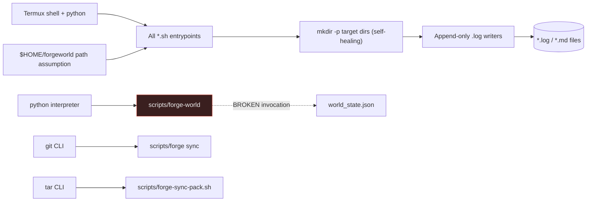
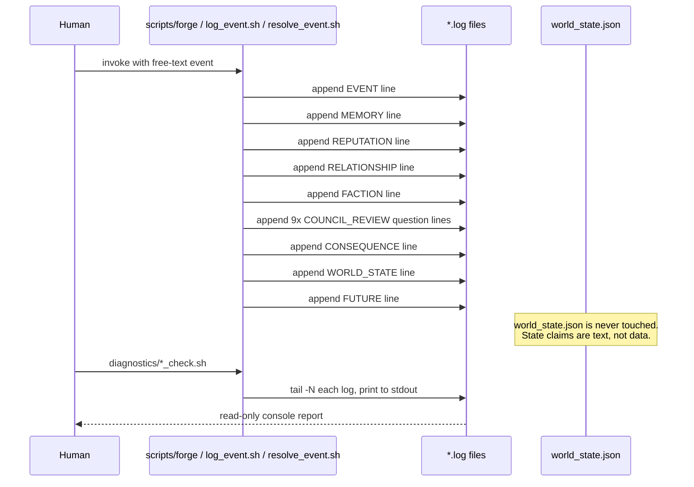
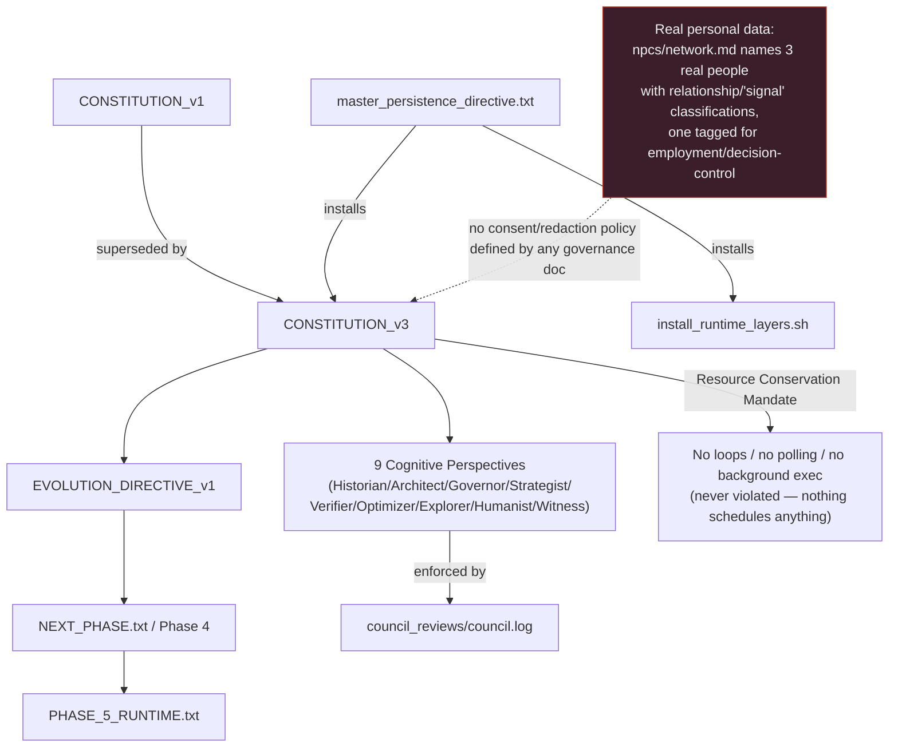
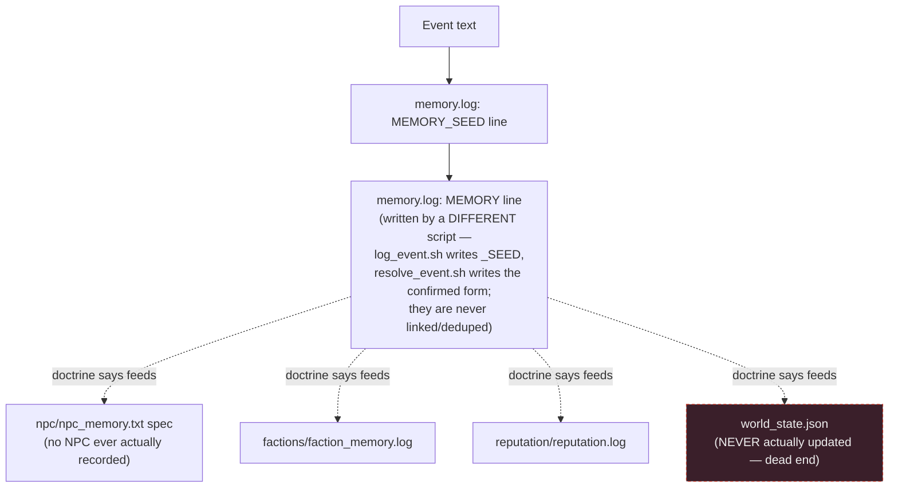
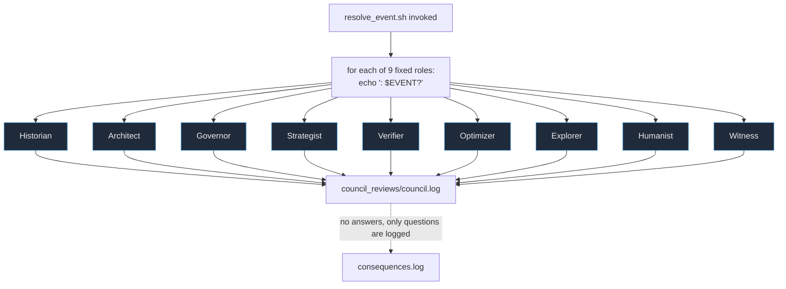

# FORGEWORLD — Repository Intelligence Model

Mission 2 deliverable. This is an analysis artifact, not a feature change: it maps what
the repository *actually is* today (verified against every file, not the doctrine's
claims about itself), so future work can be sequenced with evidence instead of vibes.
No code was modified to produce this document.

## 0. Reality Baseline

FORGEWORLD is a **doctrine-and-bash scaffold**, not a running system. It is a set of
text specifications (`governance/`, `doctrine/`) describing a nine-perspective,
nine-stage "continuity engine," paired with ~10 small Termux bash scripts that append
lines to `.log` files. There is no application code, no server, no database, no tests,
no CI, no package manifest, no LICENSE, and no `.gitignore`. The three `install_*.sh`
files are literally how most of the tree was generated (they heredoc-write the very
`governance/`, `diagnostics/`, and root scripts you can read today) — the repo is close
to 100% reproducible from those three installers plus the doctrine files.

Exactly **one** event has ever been pushed through the full pipeline end-to-end
(`"Player defeated Crystal Warden in the northern ruins"`, logged 2026-06-11). That one
run is the entirety of the system's empirical validation evidence.

Two load-bearing facts drive most of the findings below:
1. **The pipeline never writes structured state.** `resolve_event.sh` / `log_event.sh`
   only `>>` append human-readable sentences to `.log` files. `world_state.json` (both
   copies) still reads all-zero resources — nothing has ever programmatically written
   to it. The JSON "world state" the doctrine calls canonical is decorative.
2. **Everything assumes `$HOME/forgeworld` on a Termux phone.** Every script hardcodes
   `BASE="$HOME/forgeworld"` and the shebang `#!/data/data/com.termux/files/usr/bin/bash`.
   In this checkout (`/home/user/forgeworld-runtime`), every script silently no-ops or
   errors unless invoked with `BASE` overridden — a fact worth knowing before anyone
   tries to "run" this repo in CI, on a laptop, or in an agent sandbox.

---

## 1. Repository Knowledge Graph

What exists, and which artifact governs which other artifact.

```mermaid
graph TD
  subgraph Doctrine["Doctrine Layer (aspirational spec)"]
    D1[doctrine/FORGEWORLD_RUNTIME.md]
    D2[doctrine/FORGEWORLD_CIVILIZATION_RUNTIME_v2.md]
    D3["doctrine/governance.md (empty)"]
    D4["doctrine/identity.md (empty)"]
    D5["doctrine/linkedin_protocol.md (empty)"]
  end

  subgraph Governance["Governance Layer (normative rules)"]
    G1[governance/CONSTITUTION_v1.txt]
    G3[governance/CONSTITUTION_v3.txt]
    G4[governance/EVOLUTION_DIRECTIVE_v1.txt]
    G5[governance/FORGEWORLD_RUNTIME_v2.txt]
    G6["governance/NEXT_PHASE.txt (Phase 4)"]
    G7[governance/PHASE_5_RUNTIME.txt]
    G8[governance/master_persistence_directive.txt]
  end

  subgraph Executables["Executable Layer"]
    E1[install_runtime_layers.sh]
    E2[install_constitution_v3.sh]
    E3[install_phase5_runtime.sh]
    E4[log_event.sh]
    E5[resolve_event.sh]
    E6[runtime.sh]
    E7[scripts/forge]
    E8[scripts/forge-*.sh]
    E9[diagnostics/*.sh]
  end

  subgraph State["State / Data Layer"]
    S1[events/*.log]
    S2[memory/*.log,.md]
    S3[reputation/*.log,.txt]
    S4[relationships/relationships.log]
    S5[factions/*.log,.txt]
    S6[council_reviews/council.log]
    S7[consequences/*.log,.txt]
    S8["world/world_state.{json,log,txt}"]
    S9["world_state.json (root, duplicate)"]
    S10[future/future_opportunities.log]
    S11[rpg/player.json]
    S12[quests/active_quests.md]
    S13["npcs/network.md (real people)"]
    S14[inbox/capture.md, CAPTURE.md]
  end

  D1 --> G5
  D2 --> G4
  G1 --> G3
  G4 --> G7
  G6 --> G7
  G8 --> E1
  G3 -.spec only, never scaffolded.-> Continuity["continuity/ (declared, MISSING)"]

  E1 --> S1 & S2 & S5 & S3 & S7 & S8 & S14
  E2 --> G3
  E3 --> G7 & E5 & E9
  E4 --> S1 & S2 & S7 & S8
  E5 --> S1 & S2 & S3 & S4 & S5 & S6 & S7 & S8 & S10
  E7 --> S14 & S1 & S13 & S12
  E9 -.reads only.-> S1 & S2 & S3 & S7 & S8 & S6

  classDef missing fill:#3a1f1f,stroke:#c0392b,color:#eee,stroke-dasharray: 4 3;
  class Continuity missing
```



**Key fact this graph exposes:** the "spec" files in `events/event_logger.txt`,
`memory/memory_writer.txt`, `npc/npc_memory.txt`, `factions/faction_memory.txt`,
`reputation/reputation_system.txt`, `consequences/consequence_engine.txt`,
`world/world_state.txt` describe rich per-record schemas (trust, fear, loyalty, hidden
effects, rollback…) that **no script populates**. They are documentation of intent, not
implemented schemas.

---

## 2. Runtime Dependency Graph

What must exist/succeed before something else can run.



No package manager, no lockfile, no version pin. Dependencies are three POSIX-ish
binaries (`bash`, `python`, `git`/`tar` for sync) that are assumed present, never
checked. `scripts/forge-world` is the only script with an external interpreter
dependency (`python`) and it is currently **broken** (see §4 Validation Graph, F-1).

---

## 3. Execution Graph

Actual control flow when a human runs the system (there is no automated trigger —
Phase 5 doctrine explicitly forbids background/loop execution: "Act only when manually
invoked").



Execution is entirely synchronous, single-user, single-machine, and stateless between
invocations except for the flat log files. There is no queue, no scheduler, no retry,
no idempotency key — running `resolve_event.sh "same text"` twice produces two
indistinguishable log entries.

---

## 4. Validation Graph

What evidence exists that each layer behaves as specified, and where it's missing or
contradicted.

```mermaid
graph TD
  V0["1 manually-run event\n(Crystal Warden, 2026-06-11)"] --> V1[events.log ✅]
  V0 --> V2[memory.log ✅]
  V0 --> V3[consequences.log ✅]
  V0 --> V4[world_state.log ✅ text-only]
  V0 --> V5[reputation.log ✅]
  V0 --> V6[relationships.log ✅]
  V0 --> V7[faction_memory.log ✅]
  V0 --> V8[council.log ✅]
  V0 --> V9[future_opportunities.log ✅]
  V0 -.never reached.-> V10["world_state.json fields ❌ still all-zero"]

  F1["F-1: scripts/forge-world runs\n`python \"$WORLD\" <&lt;&lt;'PY'`\nwhich executes the JSON file itself\nas a Python script instead of piping\nstdin — will raise SyntaxError, not print state"]
  F2["F-2: scripts/forge-signal captures\nSOURCE/TYPE/SIGNAL to stdout only;\nthe trailing `>> signals.log` has no\ncommand attached, so nothing is ever\nappended to disk — captured signals\nare silently lost"]
  F3["F-3: world_state.json (root) and\nworld/world_state.json use two\nincompatible schemas — no code\nreconciles them"]
  F4["F-4: governance/CONSTITUTION_v3.txt\ndeclares continuity/ as a system role;\nno such directory was ever created\nby any installer"]
  F5["F-5: 3 empty doctrine files\n(governance.md, identity.md,\nlinkedin_protocol.md) — referenced\nby the runtime topology, contain 0 bytes"]

  classDef bug fill:#3a1f1f,stroke:#c0392b,color:#eee;
  class F1,F2,F3,F4,F5 bug
```

There is no test suite, no CI workflow, and no assertion anywhere in the repo — all
"validation" to date has been a human reading log tails after one manual run.

---

## 5. Governance Graph

Normative documents and the authority chain they claim.



Governance today is **advisory prose**, not enforced code — nothing in the repo checks
a constitutional rule before an action; the "check" scripts only report state, they
never gate it (no exit-code failure path, no pre-commit hook, no CI gate).

---

## 6. Commercial Asset Graph

What in this repo has (or claims) exchangeable value.

```mermaid
graph LR
  subgraph Assets["Actual assets today"]
    A1["Doctrine IP — a coherent\nevent-sourcing / continuity\nvocabulary (event→evidence→memory→\nreputation→consequence→world-state)"]
    A2["3 real professional contacts\nlogged as 'signals' (npcs/network.md)"]
    A3["Command-language UX\n(commands/FORGE_COMMANDS.md,\nscripts/forge dispatcher)"]
  end
  subgraph Aspirational["Claimed but not built"]
    B1["LinkedIn signal→content→publish loop\n(doctrine/linkedin_protocol.md is empty)"]
    B2["'Meaning Engine': social posts → lore/\nfactions/quests (master_persistence_directive)"]
    B3["Laptop-side synthesis/simulation/\nvisualization/export node (0 code)"]
    B4["Personal-brand narrative:\n'Civilization Architect' persona\n(rpg/player.json) for career signaling"]
  end
  A1 -->|reusable as a generic| Products["Product directions:\n- Personal CRM / relationship intelligence\n- Journaling / life-logging app\n- Narrative RPG engine\n- Governed-agent-memory framework"]
  A2 --> B4
  A3 --> Products
  B1 -.blocked on doctrine/linkedin_protocol.md being empty.-> Products
```

The commercially interesting asset is the **event-sourced continuity vocabulary**
itself (Constitution v3's causal chain + resource conservation mandate) — it is a
legitimate, reusable design pattern for auditable agent-memory systems, independent of
the RPG skin. The RPG/LinkedIn framing is currently vaporware (zero lines of code)
layered on top of that pattern.

---

## 7. Memory Graph

How "memory" actually flows versus how doctrine says it should.



Two independent scripts (`log_event.sh`, `resolve_event.sh`) both claim to be *the*
entry point into memory and both write different line formats to `memory.log` with no
shared ID, so there is no way to reconstruct which SEED line corresponds to which
confirmed MEMORY line once volume grows past a handful of entries — the "reconstruct
reality from evidence" success metric in the Constitution is not actually achievable
from the current log format.

---

## 8. Agent Communication Graph

How the "nine cognitive perspectives" (the closest thing this repo has to
multi-agent structure) actually communicate — today, entirely simulated by a static
string template, not by distinct reasoning.



No agent (LLM or otherwise) is currently wired into this loop — "Council of Minds" is
nine `echo` lines per event, each posing a question that nothing ever answers. This is
the single highest-leverage place to plug in a real model call: the doctrine already
defines the exact prompt/role decomposition an LLM orchestration layer would need.

---

## 9. Subsystem Catalog

Compact form: **Purpose / Inputs / Outputs / Depends-on / Failure modes / Recovery /
Validation evidence / Commercial leverage / Future expansion.**

### 9.1 Capture & Command Dispatch (`scripts/forge`, `forge-capture.sh`, `forge-signal`, `CAPTURE.md`, `inbox/capture.md`)
- **Purpose:** human-facing entry point for ideas/bugs/signals on the phone node.
- **Inputs:** interactive stdin (category, detail, source/type/signal).
- **Outputs:** appended lines in `CAPTURE.md` / `inbox/capture.md`; `signals.log` (intended, currently broken).
- **Dependencies:** Termux bash, writable `$HOME/forgeworld`.
- **Failure modes:** F-2 (forge-signal drops data silently); no input validation — `inbox/capture.md`'s one real entry shows the TYPE field captured literally as `"forge eventforge npcforge-signal"`, evidence of a copy-paste/UX error going unnoticed because nothing validates the field.
- **Recovery:** none automated; only a human re-reading the file catches malformed entries.
- **Validation evidence:** one malformed real entry; no test.
- **Commercial leverage:** UX pattern (structured capture with DATE/TYPE/DETAIL/NEXT ACTION) is reusable for any personal-CRM or journaling product.
- **Future expansion:** input validation, structured (JSON/YAML) capture instead of free text, actually wire the `signals.log` append.

### 9.2 Event Logger (`log_event.sh`, `events/event_logger.txt`, `events/events.log`)
- **Purpose:** first-class record of "something happened."
- **Inputs:** free-text `actor did action to target` string via argv.
- **Outputs:** one line each into `events.log`, `memory.log`, `consequences.log`, `world_state.log`.
- **Dependencies:** writable log directory (auto-created).
- **Failure modes:** no actor/target schema enforced despite spec requiring one; duplicate-safe only by accident (no idempotency key).
- **Recovery:** manual log editing.
- **Validation evidence:** 1 run, matches expected output format.
- **Commercial leverage:** minimal generic event-sourcing shim; reusable pattern, not reusable code (10 lines).
- **Future expansion:** structured event schema (JSON Lines) instead of prose sentences, actor/target fields, event IDs for cross-log joins.

### 9.3 Memory Writer (`memory/memory_writer.txt`, `memory/memory.log`, `memory/memory.md`)
- **Purpose:** compress events into "why it mattered."
- **Inputs:** event string from `log_event.sh`/`resolve_event.sh`.
- **Outputs:** `MEMORY_SEED`/`MEMORY` lines.
- **Dependencies:** Event Logger.
- **Failure modes:** SEED vs confirmed MEMORY written by two different scripts with no linking ID (Memory Graph finding); `memory.md` is a separate, disconnected free-form spec never referenced by any script.
- **Recovery:** none.
- **Validation evidence:** 2 lines total, ever.
- **Commercial leverage:** the "compression, not storage" principle is the most defensible IP in the repo for an agent-memory product.
- **Future expansion:** real summarization (LLM-backed), dedup, cross-reference IDs.

### 9.4 NPC Memory (`npc/npc_memory.txt` spec) vs. Network Ledger (`npcs/network.md` data)
- **Purpose:** per-character continuity (fictional) — but the only populated file under this name (`npcs/`) actually holds **real people** (LinkedIn contacts), a naming collision between two directories (`npc/` singular = spec, `npcs/` plural = real data).
- **Inputs:** manual entry via `scripts/forge npc`.
- **Outputs:** `npcs/network.md` entries.
- **Dependencies:** Command Dispatch.
- **Failure modes:** conflation of fictional-NPC modeling with real personal/professional data; no separation of concerns or access control between "game data" and "real relationship data."
- **Recovery:** rename/split directories; needs a decision, not a script fix.
- **Validation evidence:** 3 real entries, 0 fictional entries — the fictional-NPC use case has never actually been exercised.
- **Commercial leverage:** if intentionally a relationship-intelligence tool, this is the actual product core; if unintentional, it's a governance risk (see §5).
- **Future expansion:** decide the real product identity (RPG engine vs. CRM) before building further — see Roadmap RESEARCH item.

### 9.5 Faction Memory (`factions/faction_memory.txt`, `.log`)
- **Purpose:** institutional (group-level) memory distinct from individual memory.
- **Inputs:** event string.
- **Outputs:** one templated line per event.
- **Dependencies:** Event Logger / Council.
- **Failure modes:** no faction ever defined (no faction registry exists anywhere in the repo) — the log references "factions" abstractly with no faction ever named.
- **Recovery:** n/a.
- **Validation evidence:** 1 line.
- **Commercial leverage:** low until faction registry exists.
- **Future expansion:** faction registry (JSON), goals/allies/enemies fields from spec actually populated.

### 9.6 Reputation System (`reputation/reputation_system.txt`, `.log`)
- **Purpose:** translate behavior into social consequence scores.
- **Inputs:** event string.
- **Outputs:** one templated line per event ("Reputation requires evaluation after: …") — note it never actually *computes* a reputation value, only flags that evaluation is needed.
- **Dependencies:** Event Logger.
- **Failure modes:** spec lists 10 tracked dimensions (trust, fear, honor…); zero are ever assigned a value anywhere in the repo.
- **Recovery:** n/a.
- **Validation evidence:** 1 line.
- **Commercial leverage:** trust-scoring pattern is reusable if implemented.
- **Future expansion:** actual scoring function, not just a "needs evaluation" flag.

### 9.7 Relationship Tracker (`relationships/relationships.log`)
- **Purpose:** track trust between actors.
- **Inputs:** event string.
- **Outputs:** one templated line.
- **Dependencies:** Event Logger.
- **Failure modes:** no spec file exists for this subsystem at all (unlike its siblings) — it was added directly in Phase 5 doctrine and never given a `.txt` design spec.
- **Recovery:** n/a.
- **Validation evidence:** 1 line.
- **Commercial leverage:** low standalone.
- **Future expansion:** write the missing spec; define relationship data model (graph of actor pairs + weights).

### 9.8 Council of Minds (embedded in `resolve_event.sh`, logged to `council_reviews/council.log`)
- **Purpose:** multi-perspective review of every event (Historian/Architect/Governor/Strategist/Verifier/Optimizer/Explorer/Humanist/Witness).
- **Inputs:** event string.
- **Outputs:** 9 static question lines per event — **no answers**.
- **Dependencies:** `resolve_event.sh`.
- **Failure modes:** questions are never answered by anything (no LLM call, no human answer capture loop); the "review" is theater.
- **Recovery:** n/a.
- **Validation evidence:** 9 lines from the 1 test run.
- **Commercial leverage:** **highest** — this is a ready-made multi-agent prompt decomposition waiting for a model.
- **Future expansion:** wire each perspective to an actual LLM call (e.g., 9 short Claude calls or one structured multi-role prompt), persist answers not just questions. See Roadmap RESEARCH/NEXT_ITERATION.

### 9.9 Consequence Engine (`consequences/consequence_engine.txt`, `.log`)
- **Purpose:** convert actions into delayed/hidden world effects.
- **Inputs:** event string.
- **Outputs:** one templated line ("generated a consequence proposal requiring governance").
- **Dependencies:** Event Logger, Council.
- **Failure modes:** spec requires "rollback possibility" per consequence; no rollback mechanism exists anywhere in the codebase.
- **Recovery:** n/a.
- **Validation evidence:** 1 line.
- **Commercial leverage:** low until it does more than log intent.
- **Future expansion:** implement actual state mutation + rollback log.

### 9.10 World State Store (`world/world_state.{json,log,txt}`, root `world_state.json`, `scripts/forge-world`)
- **Purpose:** canonical "current reality" of the simulation.
- **Inputs:** intended to be consequences; actually nothing writes to the JSON.
- **Outputs:** static JSON (all-zero resources), free-text `.log` claiming state changes that the JSON never reflects.
- **Dependencies:** Consequence Engine (nominally).
- **Failure modes:** F-1 (forge-world's python invocation is broken), F-3 (two incompatible JSON schemas, root vs `world/`).
- **Recovery:** manual JSON editing.
- **Validation evidence:** JSON has never changed since creation; the `.log` says otherwise — a direct contradiction between the "source of truth" and its own audit trail.
- **Commercial leverage:** this is the piece any real product build depends on; currently the weakest link.
- **Future expansion:** single canonical schema, a real writer (event → state diff → JSON patch), fix `forge-world`'s invocation (`python - "$WORLD" <<'PY' … PY` or read via `json.load(open(sys.argv[1]))` with `python "$0" "$WORLD"` semantics corrected).

### 9.11 Future Opportunity Generator (`future/future_opportunities.log`)
- **Purpose:** surface what becomes possible after a world-state change.
- **Inputs:** event string.
- **Outputs:** one templated line.
- **Dependencies:** World State (nominally; in practice just the raw event string).
- **Failure modes:** no opportunity has ever been concretely generated, only the same templated sentence.
- **Recovery:** n/a.
- **Validation evidence:** 1 line.
- **Commercial leverage:** conceptually the direct link to the "commercial asset" doctrine (opportunities → LinkedIn signal loop) but zero implementation.
- **Future expansion:** connect to §9.4/§9.13 network ledger to generate real outreach/opportunity suggestions.

### 9.12 Governance & Doctrine Layer (`governance/*`, `doctrine/*`)
- **Purpose:** normative rules and mission framing for every other subsystem.
- **Inputs:** human authorship only.
- **Outputs:** text consumed by humans (and, per the installers, re-emitted verbatim into governance files).
- **Dependencies:** none (root of the DAG).
- **Failure modes:** F-4 (continuity/ declared, never built), F-5 (3 empty doctrine files referenced by name in the runtime topology but never filled in); governance is descriptive prose with no enforcement mechanism (no linter, no pre-commit gate, no CI check that code obeys the Resource Conservation Mandate).
- **Recovery:** n/a — needs authorship, not code.
- **Validation evidence:** internally consistent across v1→v3, Phase 4→5 (no contradictions found in the text itself).
- **Commercial leverage:** the single most reusable artifact in the repo — a portable governance vocabulary for any agent-memory system, independent of the RPG skin.
- **Future expansion:** turn "governance" from prose into enforceable code (schema validators, a linter that checks the Resource Conservation Mandate, CI gate).

### 9.13 Diagnostics & Health Checks (`diagnostics/*.sh`)
- **Purpose:** read-only status reporting ("can the present state explain how it became itself?").
- **Inputs:** existing log files.
- **Outputs:** stdout report (never exits non-zero, never asserts).
- **Dependencies:** every log-producing subsystem.
- **Failure modes:** `constitution_check.sh`, `constitution_v3_check.sh`, and `phase5_check.sh` are ~80% duplicated code (same `tail -N` pattern repeated three times with cosmetic differences) — classic copy-paste drift risk (fix one, forget the other two).
- **Recovery:** n/a, no state to recover.
- **Validation evidence:** self-consistent; these scripts are themselves the "validation evidence" layer for everything else, but they only report presence/absence, never correctness.
- **Commercial leverage:** none directly; operational hygiene only.
- **Future expansion:** consolidate into one parameterized `diagnostics/check.sh --phase=5`, add actual assertions (non-zero exit on missing/malformed data) so it can run in CI.

### 9.14 Install / Bootstrap Layer (`install_*.sh`)
- **Purpose:** reproducibly (re-)generate the governance/doctrine/script tree.
- **Inputs:** none (self-contained heredocs).
- **Outputs:** the very files cataloged in §9.1–9.13.
- **Dependencies:** Termux bash.
- **Failure modes:** installers are append-idempotent for `logs/install.log` but **not** idempotent for the files they `cat >` — re-running silently overwrites any manual edits made to `governance/CONSTITUTION_v3.txt` etc. with the embedded heredoc version, with no diff/confirmation step.
- **Recovery:** git history (this is exactly what version control is for here — but there's no `.gitignore` or commit discipline documented to protect against accidental overwrite-and-commit).
- **Validation evidence:** `logs/install.log` shows 3 successful installs, timestamped.
- **Commercial leverage:** the installer-as-source-of-truth pattern is a legitimate "infrastructure as code" approach for a personal doctrine system.
- **Future expansion:** make installers diff-and-confirm before overwrite, or split "install" (idempotent, create-if-missing) from "reset" (explicit, destructive) as two distinct commands.

### 9.15 Ops Layer (`forge-sync-pack.sh`, `forge-status.sh`, `forge-log.sh`, `forge-clean.sh`, `forge sync/archive/clean`)
- **Purpose:** phone-side housekeeping — package for laptop transfer, log health, clean caches, archive.
- **Inputs:** filesystem state.
- **Outputs:** `sync/*.tar.gz`, `logs/phone_health.log`, `archive/<timestamp>/`.
- **Dependencies:** `tar`, `git`, `pkg` (Termux package manager) — `forge-clean.sh` calls `pkg clean`, which will fail hard outside Termux.
- **Failure modes:** `forge-sync-pack.sh` tar list includes directories (`ideas`, `bugs`) that don't exist anywhere in this repo — silently ignored by `tar` (`2>/dev/null`) rather than flagged, masking drift between the script's assumptions and actual repo layout.
- **Recovery:** n/a, non-destructive by design ("Clean complete. No project files deleted.").
- **Validation evidence:** none observed (no `sync/` or `archive/` directories present in this checkout).
- **Commercial leverage:** none.
- **Future expansion:** drop the dead `ideas`/`bugs` references or actually create those directories; make `forge-clean.sh` portable (guard the `pkg` call).

### 9.16 RPG Player Model & Quest Tracker (`rpg/player.json`, `quests/active_quests.md`, `tasks/*`)
- **Purpose:** gamify the user's own progress ("Civilization Architect" persona) and track concrete TODOs.
- **Inputs:** manual edits.
- **Outputs:** static JSON/Markdown.
- **Dependencies:** none.
- **Failure modes:** `player.json` attributes/resources are all `0`/`1` and have never been incremented by any script — same dead-state problem as `world_state.json`; `tasks/roadmap.md` and `tasks/milestones.md` are both 0 bytes despite being referenced as if populated.
- **Recovery:** n/a.
- **Validation evidence:** none — no script has ever written to these files.
- **Commercial leverage:** the RPG-progress framing is a plausible engagement/gamification hook for a personal-productivity product, currently unimplemented.
- **Future expansion:** wire quest completion / event resolution to actually increment `player.json` attributes; populate `tasks/roadmap.md`.

### 9.17 Command Language & Docs (`commands/FORGE_COMMANDS.md`, `README.md`, `README.txt`, `STATUS.md`, `TASKS.md`)
- **Purpose:** human-facing documentation of the command surface and current phase.
- **Inputs:** manual authorship.
- **Outputs:** stdout guidance / onboarding text.
- **Dependencies:** none.
- **Failure modes:** `commands/FORGE_COMMANDS.md` documents `FORGE.STATUS`, `FORGE.CAPTURE`, etc. (dot-notation), but the actual implemented dispatcher (`scripts/forge`) uses space-separated subcommands (`forge status`, `forge capture`) — the documented command language does not match the implemented one at all; a new user following the docs would type commands that don't exist.
- **Recovery:** n/a, doc fix only.
- **Validation evidence:** direct textual mismatch confirmed by reading both files.
- **Commercial leverage:** none directly; onboarding quality only.
- **Future expansion:** reconcile `FORGE_COMMANDS.md` with `scripts/forge`'s actual subcommands (or vice versa).

### 9.18 Network / Signal Ledger (`npcs/network.md`, `notes/observations.md`)
- **Purpose:** log real-world professional contacts and observations as "signals" per the LinkedIn Signal Acquisition doctrine.
- **Inputs:** manual entry.
- **Outputs:** `npcs/network.md` (3 real named individuals with relationship-type tags).
- **Dependencies:** none technical; depends entirely on the (undefined) consent/privacy posture.
- **Failure modes:** real names + inferred intent ("Opportunity Signal: Decision control / employment") committed to a version-controlled repo with no access-control statement, no redaction, no consent record, and (per repo config available to this session) no confirmed private/public visibility check performed.
- **Recovery:** git history rewrite if this needs to come out later — expensive; cheaper to decide the policy now.
- **Validation evidence:** none needed for a data-only file; the governance gap is the finding.
- **Commercial leverage:** if the intent is relationship-intelligence tooling, this is a real product seed; if incidental, it's pure liability.
- **Future expansion:** define a data-handling policy in `doctrine/linkedin_protocol.md` (currently empty) before adding a 4th contact.

---

## 10. Cross-Subsystem Ranking

Scale 1 (low) – 5 (high). **Technical Debt** is framed so 5 = worst (most debt).
**Optimization Potential** 5 = most upside per unit effort.

| Subsystem | Architectural Importance | Operational Importance | Commercial Importance | Knowledge Reuse | Technical Debt | Optimization Potential |
|---|---|---|---|---|---|---|
| 9.1 Capture & Command Dispatch | 3 | 4 | 2 | 3 | 3 | 3 |
| 9.2 Event Logger | 4 | 4 | 2 | 4 | 2 | 3 |
| 9.3 Memory Writer | 5 | 3 | 3 | 5 | 4 | 4 |
| 9.4 NPC Memory / Network Ledger | 3 | 3 | 4 | 3 | 5 | 3 |
| 9.5 Faction Memory | 2 | 1 | 1 | 2 | 3 | 2 |
| 9.6 Reputation System | 3 | 2 | 2 | 3 | 4 | 3 |
| 9.7 Relationship Tracker | 2 | 1 | 1 | 2 | 3 | 2 |
| 9.8 Council of Minds | 4 | 2 | 4 | 5 | 3 | 5 |
| 9.9 Consequence Engine | 4 | 2 | 2 | 4 | 4 | 3 |
| 9.10 World State Store | 5 | 4 | 4 | 4 | 5 | 5 |
| 9.11 Future Opportunity Generator | 2 | 1 | 3 | 2 | 3 | 3 |
| 9.12 Governance & Doctrine | 5 | 3 | 5 | 5 | 2 | 3 |
| 9.13 Diagnostics | 2 | 4 | 1 | 2 | 3 | 3 |
| 9.14 Install / Bootstrap | 4 | 3 | 1 | 3 | 3 | 3 |
| 9.15 Ops Layer | 1 | 3 | 1 | 1 | 2 | 2 |
| 9.16 RPG Player/Quest Model | 2 | 2 | 3 | 2 | 3 | 3 |
| 9.17 Command Docs | 1 | 3 | 1 | 1 | 2 | 2 |
| 9.18 Network / Signal Ledger | 2 | 2 | 4 | 2 | 5 | 2 |

**Reading the table:** Governance/Doctrine (9.12) and World State (9.10) anchor the
architecture (importance 5) but sit at opposite debt extremes — governance is clean
prose, world state is broken/contradictory code. Council of Minds (9.8) is the standout
outlier: modest current importance but the single highest optimization potential in the
repo, because it's a fully-specified multi-agent prompt structure with zero AI wired in.
Network Ledger (9.4/9.18) carries the highest debt *relative to its size* because the
"debt" isn't code quality, it's an unresolved privacy/consent question sitting in git
history.

---

## 11. Prioritized Roadmap

### EXECUTE_NOW
Small, low-risk, high-clarity fixes to bugs already confirmed by reading the code.

1. Fix `scripts/forge-world`'s broken Python invocation (F-1): change
   `python "$WORLD" <<'PY'` to read the JSON via `sys.argv[1]` correctly
   (`python - "$WORLD" <<'PY'`), or just `json.load(open(sys.argv[1]))` with the script
   passed on stdin via `-`.
2. Fix `scripts/forge-signal`'s orphaned redirect (F-2) so captured signals actually
   reach `events/signals.log` instead of vanishing after being printed once.
3. Reconcile the two `world_state.json` schemas (root vs. `world/`) into one canonical
   file/schema (F-3) — pick one location, delete or clearly deprecate the other.
4. Decide and document a data-handling policy for `npcs/network.md` before any new real
   person is added (§9.18) — private repo confirmation, redaction rule, or move to a
   non-committed local file.
5. Reconcile `commands/FORGE_COMMANDS.md` (dot-notation) with `scripts/forge`'s actual
   space-separated subcommands — currently the onboarding doc is simply wrong.
6. Either populate or delete the three empty doctrine files
   (`governance.md`, `identity.md`, `linkedin_protocol.md`) and the two empty task files
   (`roadmap.md`, `milestones.md`) — dead placeholders that look like missing content to
   anyone (human or agent) navigating the repo.

### NEXT_ITERATION
Requires small design decisions but no new architecture.

1. Make `resolve_event.sh`/`log_event.sh` actually mutate `world_state.json` (a real
   JSON patch per event) instead of only appending prose to `.log` files — this is the
   precondition for the JSON ever being trustworthy as "canonical state."
2. Consolidate `diagnostics/constitution_check.sh`, `constitution_v3_check.sh`, and
   `phase5_check.sh` into one parameterized script; add non-zero exit codes on
   missing/malformed data so it's CI-able.
3. Resolve the `npc/` (spec) vs `npcs/` (real data) naming collision — rename one.
4. Give `relationships/` the design spec its siblings have (`relationships_model.txt`),
   and define an actual data model (weighted actor-pair graph) instead of template
   lines.
5. Add a minimal CI workflow that runs one synthetic event through `resolve_event.sh`
   and asserts every downstream log received the expected line — turns the current
   "one manual example" into regression-protected validation evidence.
6. Fix `forge-sync-pack.sh`'s references to non-existent `ideas`/`bugs` directories.

### LONG_TERM
Real build effort; changes the shape of the system.

1. Build the "LAPTOP NODE" (synthesis / simulation / visualization / export) that every
   doctrine file promises but that has zero code today — this is the other half of the
   two-node topology the whole repo assumes.
2. Implement the `continuity/` module declared in Constitution v3 §Runtime Topology but
   never scaffolded by any installer (F-4).
3. Turn `world_state.json` from a hand-editable static file into a real state store
   (even something as simple as SQLite) with a query surface, once event volume exceeds
   what flat JSON patches can sanely represent.
4. Build the actual LinkedIn signal → structured record → content → publish loop the
   doctrine describes (`doctrine/linkedin_protocol.md` is currently empty) — this is
   the only path to the "commercial" half of the Commercial Asset Graph becoming real.
5. Add rollback capability to the Consequence Engine per its own spec requirement
   ("A consequence that does not change future state is not a consequence" / rollback
   field never implemented).

### RESEARCH
Needs a product/identity decision before engineering starts.

1. **Wire the Council of Minds to an actual model.** The nine-perspective structure in
   `resolve_event.sh` is a ready-made multi-role prompt; today it logs nine unanswered
   questions per event. Decide: one multi-role Claude call per event, or nine
   independent calls, and whether answers get written back into `council.log` or into a
   structured per-event record. This is the highest-optimization-potential item in the
   whole repository (see §10) precisely because the spec work is already done.
2. **Decide what FORGEWORLD actually is as a product.** Three plausible identities
   coexist in the doctrine and are pulling the design in different directions: (a) a
   solo narrative RPG/simulation engine, (b) a personal relationship-intelligence/CRM
   tool (evidenced by `npcs/network.md` holding real contacts), (c) a general-purpose
   governed-agent-memory framework (evidenced by the portable Constitution v3
   vocabulary). Each implies a different data model, different privacy posture, and
   different "commercial leverage" story. Building further without resolving this will
   keep producing subsystems like 9.4/9.18 that don't cleanly belong to any one
   identity.
3. **Privacy/consent model for real personal data feeding an automated pipeline.**
   Once the Council of Minds or Future Opportunity Generator is live and actually acting
   on `npcs/network.md` entries (e.g., generating outreach suggestions about a named
   person), that crosses from "personal notes" into "automated processing of a third
   party's data" — worth a deliberate policy before automation reaches that file.

---

## 12. How to Use This Document

This file is meant to be read again before the next mission, not archived. When new
subsystems are added, extend §9's catalog and re-score §10 rather than starting a new
analysis from scratch — the value of this artifact compounds only if it's kept current
rather than regenerated wholesale each time.
